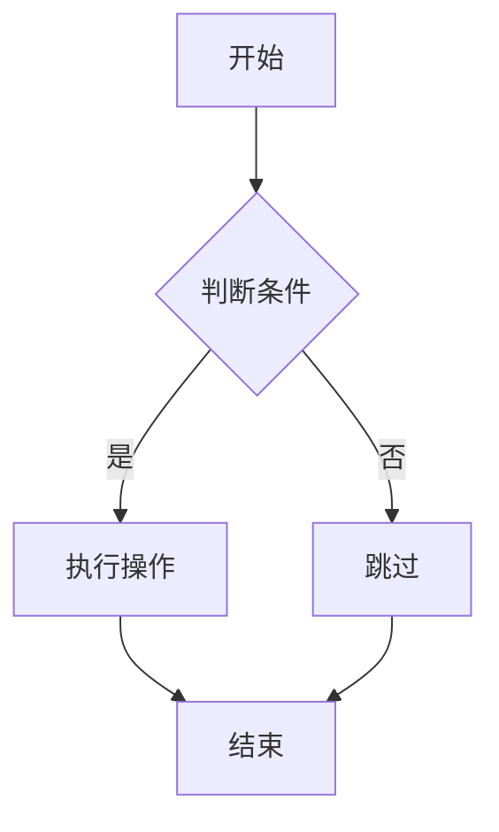

# X-Markdown

<div align="center">

一个功能强大的 Vue 3 Markdown 渲染组件库，支持流式渲染、代码高亮、LaTeX 数学公式、Mermaid 图表等特性。

[](LICENSE)
[](https://vuejs.org/)
[](https://www.typescriptlang.org/)

</div>

## ✨ 特性

- 🚀 **Vue 3 组合式 API** - 基于 Vue 3 Composition API 构建
- 📝 **GitHub Flavored Markdown** - 完整支持 GFM 语法
- 🎨 **代码高亮** - 基于 Shiki，支持 100+ 语言和多种主题
- 🌊 **流式渲染** - 支持 AI 对话场景的实时输出动画
- 🧮 **LaTeX 数学公式** - 支持行内和块级数学公式渲染
- 📊 **Mermaid 图表** - 支持流程图、时序图等多种图表
- 🌗 **深色模式** - 内置深浅色主题切换支持
- 🔌 **高度可定制** - 支持自定义渲染、插槽和属性
- 🎭 **灵活的插件系统** - 支持 remark 和 rehype 插件扩展
- 🔒 **安全可靠** - 可选的 HTML 内容清理和消毒
- 📦 **Monorepo 架构** - 使用 pnpm workspace 和 Turbo 管理

## 📦 安装

```bash
# pnpm (推荐)
pnpm add x-markdown

# npm
npm install x-markdown

# yarn
yarn add x-markdown
```

### 依赖项

确保安装了对等依赖:

```bash
pnpm add vue@^3.3.0
```

如果需要 LaTeX 支持，还需要引入 KaTeX 样式:

```ts
import 'katex/dist/katex.min.css'
```

## 🚀 快速开始

### 基础用法

```vue
<template>
  <MarkdownRenderer :markdown="content" />
</template>

<script setup lang="ts">
import { ref } from 'vue'
import { MarkdownRenderer } from 'x-markdown'
import 'x-markdown/style'

const content = ref(`
# Hello World

This is a **markdown** renderer.
`)
</script>
```

### 异步渲染

对于大型文档，可以使用异步渲染模式:

```vue
<template>
  <Suspense>
    <MarkdownRendererAsync :markdown="content" />
    <template #fallback>
      <div>加载中...</div>
    </template>
  </Suspense>
</template>

<script setup lang="ts">
import { ref } from 'vue'
import { MarkdownRendererAsync } from 'x-markdown'
import 'x-markdown/style'

const content = ref('# Large Document\n...')
</script>
```

## 📖 Props 属性

| 属性 | 类型 | 默认值 | 说明 |
|------|------|--------|------|
| `markdown` | `string` | `''` | Markdown 字符串内容 |
| `allowHtml` | `boolean` | `false` | 是否允许渲染 HTML |
| `enableLatex` | `boolean` | `true` | 是否启用 LaTeX 数学公式支持 |
| `enableAnimate` | `boolean` | `false` | 是否启用流式动画效果 |
| `enableBreaks` | `boolean` | `true` | 是否将换行符转换为 `<br>` |
| `isDark` | `boolean` | `false` | 是否为深色模式 |
| `codeXProps` | `CodeXProps` | `{}` | 代码块配置选项 |
| `codeXRender` | `object` | `{}` | 自定义代码块渲染函数 |
| `codeXSlots` | `object` | `{}` | 自定义代码块插槽 |
| `customAttrs` | `CustomAttrs` | `{}` | 自定义属性对象 |
| `remarkPlugins` | `PluggableList` | `[]` | remark 插件列表 |
| `rehypePlugins` | `PluggableList` | `[]` | rehype 插件列表 |
| `sanitize` | `boolean` | `false` | 是否启用内容清洗 |
| `sanitizeOptions` | `SanitizeOptions` | `{}` | 清洗配置选项 |

### CodeXProps 代码块配置

```ts
interface CodeXProps {
  codeLightTheme?: BuiltinTheme  // 亮色主题，默认 'vitesse-light'
  codeDarkTheme?: BuiltinTheme   // 暗色主题，默认 'vitesse-dark'
  showCodeBlockHeader?: boolean  // 是否显示代码块头部
  codeMaxHeight?: string         // 代码块最大高度，如 '300px'
}
```

```vue
<MarkdownRenderer
  :markdown="content"
  :is-dark="isDark"
  :code-x-props="{
    codeLightTheme: 'github-light',
    codeDarkTheme: 'github-dark',
    showCodeBlockHeader: true,
    codeMaxHeight: '400px'
  }"
/>
```

## 🎨 主题配置

### 深色模式

通过 `isDark` 属性控制整体主题：

```vue
<template>
  <MarkdownRenderer :markdown="content" :is-dark="isDark" />
</template>

<script setup>
import { ref } from 'vue'

const isDark = ref(false)

const toggleTheme = () => {
  isDark.value = !isDark.value
}
</script>
```

### 代码高亮主题

支持所有 [Shiki 内置主题](https://shiki.style/themes)：

```vue
<MarkdownRenderer
  :markdown="content"
  :code-x-props="{
    codeLightTheme: 'github-light',
    codeDarkTheme: 'one-dark-pro'
  }"
/>
```

## 🔧 自定义渲染

### 自定义属性

通过 `customAttrs` 为 Markdown 元素添加自定义属性：

```vue
<MarkdownRenderer
  :markdown="content"
  :custom-attrs="{
    heading: (node, { level }) => ({
      class: ['heading', `heading-${level}`],
      id: `heading-${level}`
    }),
    a: (node) => ({
      target: '_blank',
      rel: 'noopener noreferrer'
    })
  }"
/>
```

### 自定义插槽

组件提供了多个插槽，可以自定义任何元素的渲染：

```vue
<MarkdownRenderer :markdown="content">
  <!-- 自定义标题渲染 -->
  <template #heading="{ node, level, children }">
    <component :is="`h${level}`" class="custom-heading">
      <component :is="children" />
    </component>
  </template>

  <!-- 自定义引用块渲染 -->
  <template #blockquote="{ children }">
    <blockquote class="custom-blockquote">
      <div class="quote-icon">💬</div>
      <component :is="children" />
    </blockquote>
  </template>

  <!-- 自定义链接渲染 -->
  <template #a="{ node, children }">
    <a :href="node?.properties?.href" target="_blank" class="custom-link">
      <component :is="children" />
      <span>↗</span>
    </a>
  </template>
</MarkdownRenderer>
```

### 自定义代码块渲染器

通过 `codeXRender` 自定义特定语言的代码块渲染：

```vue
<script setup>
import { h } from 'vue'
import EchartsRenderer from './EchartsRenderer.vue'

const codeXRender = {
  // 自定义 echarts 代码块渲染
  echarts: (props) => h(EchartsRenderer, { code: props.raw.content }),
  // 自定义行内代码渲染
  inline: (props) => h('code', { class: 'custom-inline' }, props.raw.content)
}
</script>

<template>
  <MarkdownRenderer :markdown="content" :code-x-render="codeXRender" />
</template>
```

### 代码块插槽

通过 `codeXSlots` 自定义代码块的头部区域：

```vue
<script setup>
import { h } from 'vue'

const codeXSlots = {
  'header-left': ({ language }) => h('span', { class: 'lang-badge' }, language),
  'header-right': ({ code, copy }) => h('button', { onClick: () => copy(code) }, '📋 复制')
}
</script>

<template>
  <MarkdownRenderer :markdown="content" :code-x-slots="codeXSlots" />
</template>
```

## 🌊 流式渲染动画

启用 `enableAnimate` 属性后，代码块中的每个 token 会添加 `x-md-animated-word` class，可配合 CSS 实现流式输出动画效果：

```vue
<MarkdownRenderer :markdown="content" :enable-animate="true" />
```

```css
/* 自定义动画样式 */
.x-md-animated-word {
  animation: fadeIn 0.3s ease-in-out;
}

@keyframes fadeIn {
  from {
    opacity: 0;
  }
  to {
    opacity: 1;
  }
}
```

## 🔌 插件系统

### remark 插件

```vue
<script setup>
import remarkEmoji from 'remark-emoji'

const remarkPlugins = [remarkEmoji]
</script>

<template>
  <MarkdownRenderer :markdown="content" :remark-plugins="remarkPlugins" />
</template>
```

### rehype 插件

```vue
<script setup>
import rehypeSlug from 'rehype-slug'
import rehypeAutolinkHeadings from 'rehype-autolink-headings'

const rehypePlugins = [rehypeSlug, rehypeAutolinkHeadings]
</script>

<template>
  <MarkdownRenderer :markdown="content" :rehype-plugins="rehypePlugins" />
</template>
```

## 🛡️ 安全配置

启用内容清洗以防止 XSS 攻击：

```vue
<MarkdownRenderer
  :markdown="untrustedContent"
  :sanitize="true"
  :sanitize-options="{
    allowedTags: ['h1', 'h2', 'p', 'a', 'code', 'pre'],
    allowedAttributes: {
      a: ['href', 'target']
    }
  }"
/>
```

## 📁 项目结构

```
x-markdown/
├── packages/
│   ├── x-markdown/          # 核心组件库
│   │   ├── src/
│   │   │   ├── components/  # Vue 组件
│   │   │   │   ├── CodeBlock/   # 代码块组件（支持高亮、折叠、复制）
│   │   │   │   ├── CodeLine/    # 行内代码组件（支持高亮）
│   │   │   │   ├── CodeX/       # 代码渲染调度器
│   │   │   │   └── Mermaid/     # Mermaid 图表组件
│   │   │   ├── core/        # 核心渲染逻辑
│   │   │   ├── hooks/       # 组合式函数
│   │   │   │   ├── useHighlight.ts  # 代码高亮 Hook
│   │   │   │   ├── useTheme.ts      # 主题管理 Hook
│   │   │   │   ├── useComponents.ts # 组件映射 Hook
│   │   │   │   └── usePlugins.ts    # 插件管理 Hook
│   │   │   ├── MarkdownRender/      # 主渲染组件
│   │   │   └── plugins/     # 内置插件
│   │   └── package.json
│   └── playground/          # 演示应用
├── docs/                    # 文档
├── package.json
├── pnpm-workspace.yaml
└── turbo.json
```

## 🛠️ 开发

```bash
# 安装依赖
pnpm install

# 启动开发服务器
pnpm dev

# 构建
pnpm build

# 格式化代码
pnpm format
```

## 📄 License

[MIT](./LICENSE) License © 2024

## 📖 API 文档

### Props

| 属性 | 类型 | 默认值 | 说明 |
|------|------|--------|------|
| `markdown` | `string` | `''` | Markdown 内容 |
| `customAttrs` | `CustomAttrs` | `{}` | 自定义 HTML 元素属性 |
| `remarkPlugins` | `PluggableList` | `[]` | Remark 插件列表 |
| `rehypePlugins` | `PluggableList` | `[]` | Rehype 插件列表 |
| `sanitize` | `boolean` | `false` | 是否清理 HTML 内容 |
| `sanitizeOptions` | `SanitizeOptions` | - | HTML 清理选项 |
| `rehypeOptions` | `TRehypeOptions` | `{}` | Rehype 转换选项 |
| `enableLatex` | `boolean` | `false` | 启用 LaTeX 数学公式 |
| `allowHtml` | `boolean` | `false` | 允许原始 HTML |
| `enableBreaks` | `boolean` | `false` | 启用换行符转换 |
| `isDark` | `boolean` | `false` | 深色模式 |
| `codeXProps` | `CodeXProps` | - | 代码块配置选项 |

### 代码块选项 (CodeXProps)

```typescript
interface CodeXProps {
  enableCodeCopy?: boolean;        // 启用代码复制按钮
  enableThemeToggle?: boolean;     // 启用主题切换
  enableCodeLineNumber?: boolean;  // 启用行号显示
}
```

### 自定义属性 (customAttrs)

通过 `customAttrs` 可以对 Markdown 渲染的 HTML 节点动态添加自定义属性:

```typescript
const customAttrs = {
  // 为所有标题添加自定义类
  heading: (node, { level }) => ({
    class: ['heading', `heading-${level}`],
    id: `heading-${level}`
  }),

  // 为所有链接添加属性
  a: {
    target: '_blank',
    rel: 'noopener noreferrer'
  },

  // 为图片添加懒加载
  img: {
    loading: 'lazy'
  },

  // 为代码块添加自定义样式
  code: (node, { inline }) => ({
    class: inline ? 'inline-code' : 'block-code'
  })
};
```

### 插槽

组件提供了灵活的插槽系统，可以自定义任何 HTML 元素的渲染:

#### 标题插槽

```vue
<MarkdownRenderer :markdown="content">
  <template #heading="{ level, children }">
    <component :is="`h${level}`" class="custom-heading">
      <a :href="`#heading-${level}`">#</a>
      <component :is="children" />
    </component>
  </template>
</MarkdownRenderer>
```

#### 代码块插槽

```vue
<MarkdownRenderer :markdown="content">
  <template #code="{ language, content, inline, children }">
    <div v-if="!inline" class="custom-code-block">
      <div class="code-header">{{ language }}</div>
      <component :is="children" />
    </div>
    <code v-else class="custom-inline-code">
      <component :is="children" />
    </code>
  </template>
</MarkdownRenderer>
```

#### 列表插槽

```vue
<MarkdownRenderer :markdown="content">
  <template #list="{ ordered, depth, children }">
    <component
      :is="ordered ? 'ol' : 'ul'"
      :class="`list-depth-${depth}`"
    >
      <component :is="children" />
    </component>
  </template>
</MarkdownRenderer>
```

#### 表格插槽

```vue
<MarkdownRenderer :markdown="content">
  <template #tr="{ isHead, children }">
    <tr :class="{ 'table-header': isHead }">
      <component :is="children" />
    </tr>
  </template>
</MarkdownRenderer>
```

### 支持的插槽类型

- `heading` / `h1` ~ `h6` - 标题
- `code` / `inline-code` / `block-code` - 代码
- `list` / `ul` / `ol` / `li` / `list-item` - 列表
- `td` / `th` / `tr` - 表格元素
- 以及所有标准 HTML 标签名

## 🎨 高级用法

### 自定义代码语言渲染器

通过 `codeXRender` 可以自定义特定语言的渲染方式:

```vue
<script setup>
import { h } from 'vue';
import EChartsComponent from './EChartsComponent.vue';

const codeXRender = {
  echarts: (props) => {
    // 自定义 echarts 代码块渲染
    return h(EChartsComponent, {
      options: JSON.parse(props.content)
    });
  },

  mermaid: (props) => {
    // Mermaid 图表会被自动处理
    return null; // 使用默认渲染
  }
};
</script>

<template>
  <MarkdownRenderer
    :markdown="content"
    :code-x-render="codeXRender"
  />
</template>
```

### 使用插件

```typescript
import remarkGfm from 'remark-gfm';
import remarkMath from 'remark-math';
import rehypeKatex from 'rehype-katex';
import rehypeRaw from 'rehype-raw';

const remarkPlugins = [remarkGfm, remarkMath];
const rehypePlugins = [rehypeKatex, rehypeRaw];
```

```vue
<template>
  <MarkdownRenderer
    :markdown="content"
    :remark-plugins="remarkPlugins"
    :rehype-plugins="rehypePlugins"
  />
</template>
```

### HTML 内容清理

启用 HTML 清理以防止 XSS 攻击:

```vue
<template>
  <MarkdownRenderer
    :markdown="content"
    :sanitize="true"
    :sanitize-options="{
      sanitizeOptions: {
        tagNames: ['p', 'strong', 'em', 'a', 'code'],
        attributes: {
          a: ['href', 'title']
        }
      }
    }"
  />
</template>
```

## 💻 开发

这是一个 monorepo 项目，使用 pnpm workspace 和 Turbo 进行管理。

### 项目结构

```
x-markdown/
├── packages/
│   ├── x-markdown/          # 核心库
│   │   ├── src/
│   │   │   ├── core/        # 核心渲染逻辑
│   │   │   ├── components/  # Vue 组件
│   │   │   ├── hooks/       # 组合式函数
│   │   │   ├── plugins/     # 插件系统
│   │   │   ├── types/       # TypeScript 类型定义
│   │   │   └── shared/      # 共享工具
│   │   └── package.json
│   └── playground/          # 开发和演示环境
│       ├── src/
│       └── package.json
├── pnpm-workspace.yaml
├── turbo.json
└── package.json
```

### 安装依赖

```bash
pnpm install
```

### 开发模式

```bash
# 启动所有包的开发服务器
pnpm dev

# 仅启动 playground
cd packages/playground
pnpm dev
```

### 构建

```bash
# 构建所有包
pnpm build

# 仅构建核心库
cd packages/x-markdown
pnpm build
```

### 清理

```bash
# 清理所有构建产物和 node_modules
pnpm clean
```

## 🌟 功能演示

### 代码高亮

支持多种编程语言的语法高亮:

```javascript
function greet(name) {
  console.log(`Hello, ${name}!`);
}
```

```python
def fibonacci(n):
    if n <= 1:
        return n
    return fibonacci(n-1) + fibonacci(n-2)
```

### LaTeX 数学公式

行内公式: $E = mc^2$

块级公式:

$$
\int_{-\infty}^{\infty} e^{-x^2} dx = \sqrt{\pi}
$$

### Mermaid 图表



### 表格

| 特性 | 状态 |
|------|------|
| Markdown | ✅ |
| 代码高亮 | ✅ |
| LaTeX | ✅ |
| Mermaid | ✅ |

### 任务列表

- [x] 支持基础 Markdown
- [x] 添加语法高亮
- [x] 实现 LaTeX 支持
- [x] 添加 Mermaid 图表
- [ ] 更多功能开发中...

## 🔧 技术栈

- **Vue 3** - 渐进式 JavaScript 框架
- **TypeScript** - 类型安全的 JavaScript 超集
- **Unified** - Markdown/HTML 处理生态系统
  - **remark** - Markdown 解析器
  - **rehype** - HTML 处理器
- **Shiki** - 语法高亮引擎
- **KaTeX** - 数学公式渲染
- **Mermaid** - 图表生成
- **DOMPurify** - HTML 清理工具
- **Vite** - 下一代前端构建工具
- **Turbo** - 高性能构建系统

## 📄 许可证

[MIT](./LICENSE)

Copyright (c) 2025 element-plus-x

## 🤝 贡献

欢迎提交 Issue 和 Pull Request！

## 📚 相关链接

- [Vue.js](https://vuejs.org/)
- [Unified](https://unifiedjs.com/)
- [Remark](https://remark.js.org/)
- [Rehype](https://github.com/rehypejs/rehype)
- [Shiki](https://shiki.matsu.io/)
- [KaTeX](https://katex.org/)
- [Mermaid](https://mermaid.js.org/)
